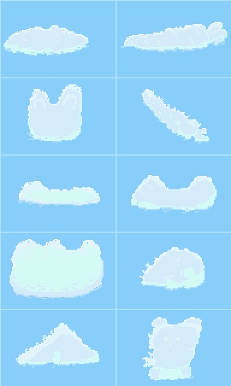

I am no artist. But alas, here I am, drawing pixel art. Who would have thought?
Not me.

Let's start by directly looking at the resulted image:

 

 

Do you see it? It is magnificent.

Each cloud is a masterpiece performance of Pixel Art. Here the image is zoomed
to 200% so that the charm of pixels is clearly seen to everyone. This is the
original size which I'm going to use in my game. If the game is made in Pixelart
style, why bother with low image dimensions?

Honestly, this is my first attempt so I will probably have to redraw all this
stuff. But I have to start somewhere. I hope this is going to be a good start.
Finish.
